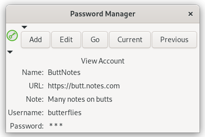

# Gtk2PasswordApp

* [VERSION 6.1.210628](https://github.com/carlosjhr64/gtk2passwordapp/releases)
* [github](https://github.com/carlosjhr64/gtk2passwordapp)
* [rubygems](https://rubygems.org/gems/gtk2passwordapp)



## Description:

Ruby-Gnome Password Manager.

Uses Blowfish to encrypt the datafile.
Features random password generator, clipboard use, and TOTP.

## Install:

```shell
$ gem install gtk2passwordapp
```

## Help:

```shell
$ gtk2passwordapp --help
Usage:
  gtk2passwordapp [:gui+]
  gtk2passwordapp :cli [<pattern> [<file>]]
  gtk2passwordapp :info
Gui:
  --minime       	Real minime
  --notoggle     	Minime wont toggle decorated and keep above
  --notdercorated	Dont decorate window
Cli:
  --nogui
Info:
  -v --version   	Show version and exit
  -h --help      	Show help and exit
# Notes #
With the --nogui cli-option,
one can give a pattern to filter by account names.
Default passwords data file is:
  ~/.cache/gtk3app/gtk2passwordapp/dump.yzb
```

## Gui:

Mouse clicks on logo:

1. `Right` to get the passwords list and select.
2. `Center` to reset the master password.
3. `Left` to get the application menu.

When you select an account,
the username/password will be in clipboard/primary for a few seconds.

View Account page:

* click on password to toggle visibility.
* click on secret to toggle TOTP(secret is password).
* `Current` button will put username/password in clipboard/primary for a few seconds. 
* `Previous` button will put password/previous in clipboard/primary for a few seconds. 

## Configuration:

```shell
$ ls ~/.config/gtk3app/gtk2passwordapp/config-?.?.rbon
```

* Salt:  If your master password length is under 14(LongPwd), it'll append this Salt.
* TooOld:  I have this set for a year (in seconds).
* PwdFile:  passwords file... you'll want include this file in your back-ups.

If you're upgrading from `gtk2pwdV`,
copy your passwords files to the new file name:

```shell
$ cp ~/.cache/gtk3app/gtk2passwordapp/gtk2pwdV.dat  ~/.cache/gtk3app/gtk2passwordapp/dump.yzb
```

And remember to set your `Salt:` in the configuration file.
The configuration file is created upon the first run of `gtk2passwordapp`, so
you'll need to do that first.

## LICENSE:

(The MIT License)

Copyright (c) 2021 CarlosJHR64

Permission is hereby granted, free of charge, to any person obtaining
a copy of this software and associated documentation files (the
'Software'), to deal in the Software without restriction, including
without limitation the rights to use, copy, modify, merge, publish,
distribute, sublicense, and/or sell copies of the Software, and to
permit persons to whom the Software is furnished to do so, subject to
the following conditions:

The above copyright notice and this permission notice shall be
included in all copies or substantial portions of the Software.

THE SOFTWARE IS PROVIDED 'AS IS', WITHOUT WARRANTY OF ANY KIND,
EXPRESS OR IMPLIED, INCLUDING BUT NOT LIMITED TO THE WARRANTIES OF
MERCHANTABILITY, FITNESS FOR A PARTICULAR PURPOSE AND NONINFRINGEMENT.
IN NO EVENT SHALL THE AUTHORS OR COPYRIGHT HOLDERS BE LIABLE FOR ANY
CLAIM, DAMAGES OR OTHER LIABILITY, WHETHER IN AN ACTION OF CONTRACT,
TORT OR OTHERWISE, ARISING FROM, OUT OF OR IN CONNECTION WITH THE
SOFTWARE OR THE USE OR OTHER DEALINGS IN THE SOFTWARE.
